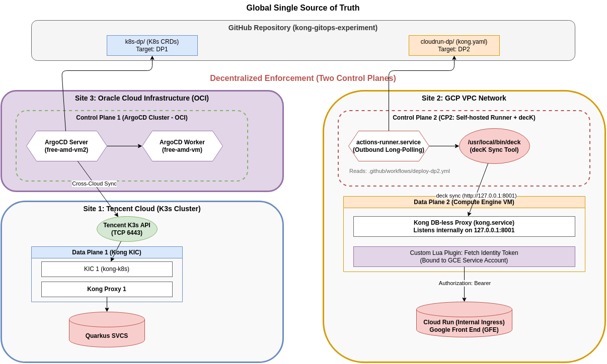

# Kong GitOps Experiment: Full-Stack Dual-Gateway Architecture



本仓库演示了如何在极度严苛的网络隔离与安全合规限制下，利用 **Kong (DB-less)** 和 **GitOps** 理念，构建一个管理混合云异构计算后端（本地 K8s 原生微服务 + GCP Cloud Run 无服务器架构）的统一流量管控平台。

## 🎯 业务背景与架构痛点 (Requirements)

我们需要部署两个独立的数据面 (Data Plane)，分别代理内网和公网的两组后端服务。面临的核心挑战如下：

1. **异构计算环境跨度大**：
   * **内部业务**：运行在受 Tailscale 零信任网络保护的局域网自建 K8s 集群中。
   * **外部业务**：运行在公有云 (GCP Cloud Run) 的 Serverless 环境中。
2. **极端的安全合规约束 (HSBC Org Policy)**：
   * GCP 的组织策略严禁 Cloud Run 开放 `allUsers` 公网访问。
   * 必须配置为“仅限内部流量 (Internal Ingress)”，且调用方必须携带合法的 Google Identity Token。
3. **架构洁癖与运维减负**：
   * 拒绝传统的 PostgreSQL 数据库，追求 100% 的 **DB-less（无状态）**。
   * 配置必须由 GitHub 作为单一真理源 (Single Source of Truth) 全盘驱动。
   * 决绝在 GCP 端部署昂贵的 GKE 集群，追求以极简的 Compute Engine VM 承载公有云网关。

## 💡 解决方案：去中心化双控制面架构 (The Solution)

为了满足上述苛刻条件，我们放弃了中心化的管理模式，采用了**“真理中心化 (GitHub) + 控制非中心化 (Decentralized Control Planes)”**的架构。

### 🛡️ Site 1: 局域网本地堡垒 (Local K8s & ArgoCD)
不仅负责流量的极低延迟路由，更是整个局域网业务的持续交付中心。
* **物理位置**：局域网私有 K8s 集群（无入站端口暴露，受 Tailscale 保护）。
* **网关形态 (DP1)**：Kong Ingress Controller (KIC) + DB-less Kong Proxy。
* **全栈控制面 (CP1)**：**ArgoCD**。
  * **降维打击的统管能力**：ArgoCD 在这里不仅负责同步 Kong 的 Ingress 网关规则，更被提升为整个集群的**“全栈大管家”**。它统一接管并自动部署底层的真实业务微服务（如 `svc1` 和 `svc2` 的 K8s Deployment 与 Service）。
  * **上帝视角**：提供企业级的 Web UI，让底层业务的拓扑结构、健康状态与顶层网关路由的映射关系一目了然。
* **工作流**：ArgoCD 持续监听 GitHub 仓库，当业务代码或网关路由发生变更时，自动拉取 YAML 并在本地 API Server 中抹平状态差异（Drift），实现 100% 的 Infrastructure as Code (IaC)。

### ☁️ Site 2: GCP 瘦前置网关 (Cloud Engine VM)
负责承接外网流量，清洗并突破内网限制调用被封锁的 Cloud Run。
* **物理位置**：GCP VPC 内部的一台极简 Compute Engine VM。
* **网关形态 (DP2)**：原生 Systemd 部署的 Standalone DB-less Kong。
* **按需控制面 (CP2)**：**GitHub Actions (Self-hosted Runner) + decK**。
* **安全鉴权破局 (The Magic)**：
  * VM 绑定了具有 `Cloud Run Invoker` 权限的 GCP Service Account。
  * 自定义 Lua 插件 (`kong-gcp-identity`) 挂载在 DP2 上。当外网请求到达时，瞬间向本地 GCE 元数据服务器申请 Google Identity Token，伪装合法身份叩开 Cloud Run 的大门。
* **工作流**：代码变更唤醒 VM 内部的 Github Runner，在本地调用 `deck sync` 经由 `127.0.0.1:8001` 刷新网关内存，全程绝不向公网暴露管理端口。

## 📁 仓库结构 (Repository Layout)

我们对目录进行了领域驱动的拆分，以完美适配双控制面的调度：

```text
kong-gitops-experiment/
├── k8s-site/                    # 👉 CP1 (ArgoCD) 统管的局域网核心领地
│   ├── business-apps/           # 1. 底层真实业务微服务 (Deployment, Service)
│   │   ├── svc1-app.yaml
│   │   └── svc2-app.yaml
│   └── gateway-config/          # 2. 顶层 Kong 网关路由配置 (Ingress)
│       └── kong-ingress.yaml
│
├── cloudrun-dp/                 # 👉 CP2 (Runner) 监听的公有云领地
│   ├── kong.yaml                # decK 专用的声明式 Kong 配置文件
│   └── plugins/
│       └── kong-gcp-identity/   # 核心鉴权组件：绕过 GCP Org Policy 的 Lua 拦截器
│
└── diagrams/
    ├── kong-gitops-architecture.drawio # 最新定稿的系统架构拓扑图
    └── architecture-preview.png        # 架构预览图
```

---
*Architected with ❤️ by Jason Poon & Moon (May 2026)*
