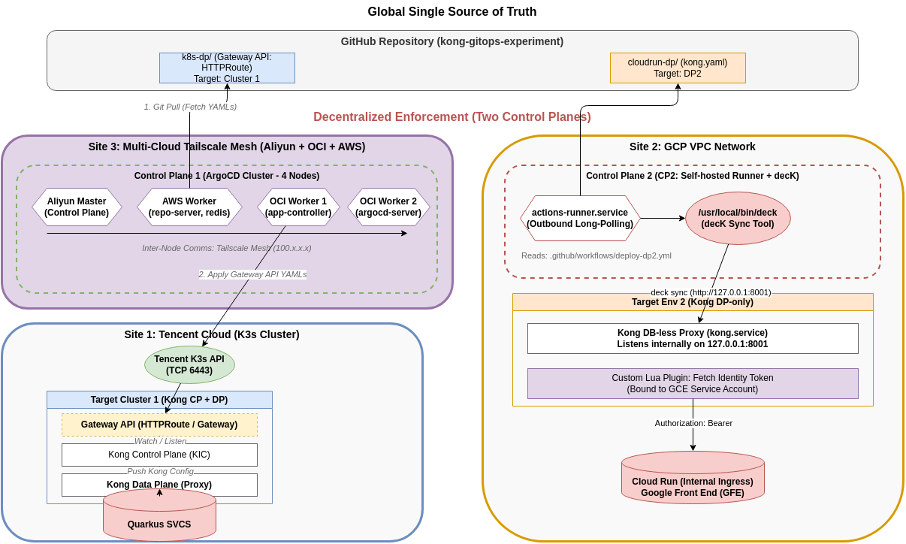

# Kong GitOps Experiment: Full-Stack Dual-Gateway Architecture



本仓库演示了如何在极度严苛的网络隔离与安全合规限制下，利用 **Kong (DB-less)** 和 **GitOps** 理念，构建一个管理混合云异构计算后端（本地 K8s 原生微服务 + GCP Cloud Run 无服务器架构）的统一流量管控平台。

## 🎯 业务背景与架构痛点 (Requirements)

我们需要部署两个独立的数据面 (Data Plane)，分别代理不同环境的两组后端服务。面临的核心挑战如下：

1. **异构计算环境跨度大**：
   * **腾讯云业务**：运行在独立的腾讯云 K3s 集群中，且需接入基于 Quarkus 的现代 Java 微服务。
   * **GCP 业务**：运行在公有云 (GCP Cloud Run) 的 Serverless 环境中。
2. **极端的安全合规约束 (HSBC Org Policy)**：
   * GCP 的组织策略严禁 Cloud Run 开放 `allUsers` 公网访问。
   * 必须配置为“仅限内部流量 (Internal Ingress)”，且调用方必须携带合法的 Google Identity Token。
3. **极端的硬件资源限制 (白嫖的代价)**：
   * 核心控制面 (ArgoCD) 必须被“塞进” Oracle Cloud (OCI) 提供的两台仅有 1Core 1GB 内存的免费虚拟机中。
4. **架构洁癖与运维减负**：
   * 拒绝传统的 PostgreSQL 数据库，追求 100% 的 **DB-less（无状态）**。
   * 配置必须由 GitHub 作为单一真理源 (Single Source of Truth) 全盘驱动。

## 💡 解决方案：去中心化控制面架构 (The Solution)

为了满足上述苛刻条件，我们放弃了传统的集中式部署，采用了**“真理中心化 (GitHub) + 控制非中心化 (Decentralized Control Planes)”**的跨云架构。

### 🛡️ Site 3 (OCI) & Site 1 (Tencent Cloud): 跨云联动 GitOps
我们将控制的大脑与执行的肉体进行了跨云解耦：

* **全栈控制面大脑 (CP1) - 位于 OCI**：
  * **极限压榨**：在一个横跨阿里云、AWS 和 OCI 的 4 节点 Tailscale 混合云大内网中，我们通过组件精细打散（Master 仅作控制面，AWS 承载高负载的 repo-server，OCI 分担 controller 和 Web UI），成功部署了 ArgoCD 的指挥部。
  * **职责拆分**：`aliyun-master` 作为集群控制面做调度；`aws-moon-proxy` 专门承担极耗内存的 GitHub 代码拉取任务；两台 OCI 节点分担应用巡检和前端入口。
* **数据面执行节点 (DP1) - 位于 Tencent Cloud**：
  * 腾讯云 K3s 节点专门用作执行地带。ArgoCD (CP1) 通过跨海公网直接连入腾讯云的 K3s API (`TCP 6443`) 进行资源下发。
  * **网关形态**：Kong Ingress Controller (KIC) 与 DB-less Kong Proxy 部署分离。KIC 独立监听 K3s API 中的 Gateway API 配置，并将配置推送给数据面的 Kong Proxy。
  * **业务形态**：基于 GraalVM 的 Quarkus 极速启动微服务。
* **工作流**：ArgoCD 持续监听 GitHub 仓库，当业务代码或网关路由发生变更时，自动拉取 YAML 并在远端的腾讯云 API Server 中抹平状态差异（Drift）。

### ☁️ Site 2: GCP 瘦前置网关 (Cloud Engine VM)
负责承接外网流量，清洗并突破内网限制调用被封锁的 Cloud Run。
* **物理位置**：GCP VPC 内部的一台极简 Compute Engine VM。
* **网关形态 (DP2)**：原生 Systemd 部署的 Standalone DB-less Kong。
* **按需控制面 (CP2)**：**GitHub Actions (Self-hosted Runner) + decK**。
* **安全鉴权破局 (The Magic)**：
  * VM 绑定了具有 `Cloud Run Invoker` 权限的 GCP Service Account。
  * 自定义 Lua 插件 (`kong-gcp-identity`) 挂载在 DP2 上。当外网请求到达时，瞬间向本地 GCE 元数据服务器申请 Google Identity Token，伪装合法身份叩开 Cloud Run 的大门。
* **工作流**：代码变更唤醒 VM 内部的 Github Runner，在本地调用 `deck sync` 经由 `127.0.0.1:8001` 刷新网关内存，全程绝不向公网暴露管理端口。

## 📁 仓库结构 (Repository Layout)

我们对目录进行了领域驱动的拆分，以完美适配双控制面的调度：

```text
kong-gitops-experiment/
├── k8s-dp/                      # 👉 CP1 (OCI ArgoCD) 统管的跨云核心领地 (部署于腾讯云)
│   ├── business-apps/           # 1. 底层真实业务微服务 (Quarkus Deployment, Service)
│   │   └── quarkus-svc-app.yaml
│   └── gateway-config/          # 2. 顶层 Kong 网关路由配置 (Gateway API: HTTPRoute 等)
│       └── kong-gateway-route.yaml
│
├── cloudrun-dp/                 # 👉 CP2 (Runner) 监听的公有云领地
│   ├── kong.yaml                # decK 专用的声明式 Kong 配置文件
│   └── plugins/
│       └── kong-gcp-identity/   # 核心鉴权组件：绕过 GCP Org Policy 的 Lua 拦截器
│
├── apps/
│   └── quarkus-svc/             # Quarkus 业务微服务 Java 源码与 Dockerfile
│
└── diagrams/
    ├── kong-gitops-architecture.drawio # 最新定稿的系统架构拓扑图
    └── architecture-preview.png        # 架构预览图
```

---
*Architected with ❤️ by Jason Poon & Moon (June 2026)*
